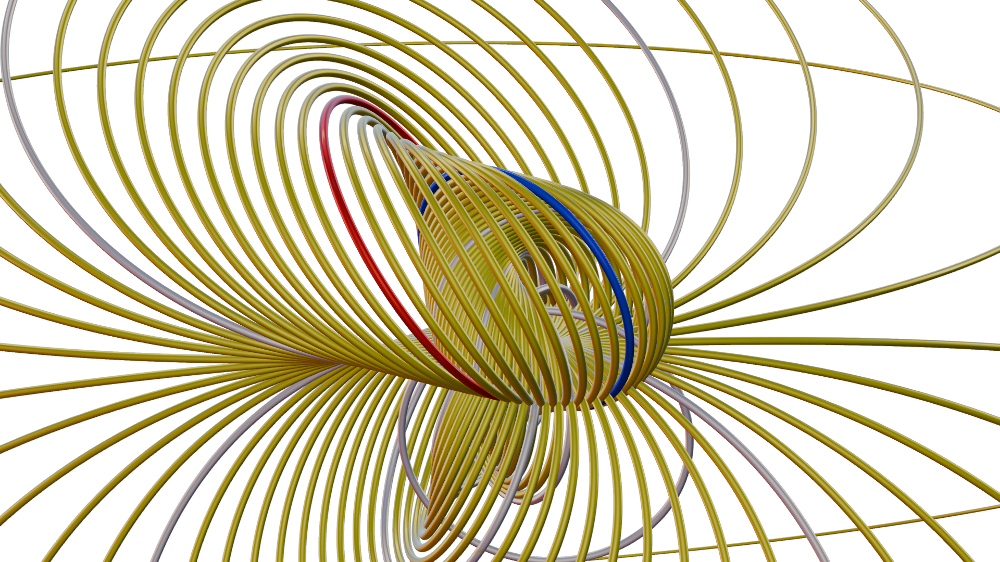

# Demo Scenes


## Interpolation of circles

This script is an example of using step-by-step visualisations and animation to describe the two rotors that can be constructed to interpolate between circles.



To run this example, ensure Geomviz is listening in Blender (See [Using Geomviz](@ref)) and paste the entire script directly into a Julia REPL or save it to a file and `include()` it.

```julia
using GeometricAlgebra
using GeometricAlgebraModels.Conformal
using Geomviz;
using Colors
using Random

# common functions
refl(B, A) = grade(B*A/B, grade(A))
norm(A) = √abs(A⊙A)
normalize(A) = A/norm(A)

function narrate(message)
  printstyled("\n$message", italic=true)
  printstyled("continue> ", color=:cyan)
  readline(stdin) # pause for user
end

seed = rand(1:1000)
@show seed
Random.seed!(seed)

# create two random circles
A = wedge(up.(randn(Multivector{3,1}, 3))...)
B = wedge(up.(randn(Multivector{3,1}, 3))...)
A /= norm(A)
B /= norm(B)

# give the circles color to keep track of them later
orig = [
  Styled(A, color=colorant"red")
  Styled(B, color=colorant"blue")
]

geomviz(orig);

narrate("""
Consider the two circles A and B shown in the 3D Viewport.
If we reflect A in B with the formula A ↦ B*A/B, and vice versa,
we obtain two more circles:
""")

objs = [A, B]
objs = normalize.([refl(a, b) for a in objs for b in objs])
geomviz([orig; objs]);

narrate("""
Repeat this, taking each ordered pair of circles and producing another by reflecting the first in the second.
""")

objs = normalize.([refl(a, b) for a in objs for b in objs])
geomviz([orig; objs]);

narrate("""
If we continued forever, we would obtain the transitive closure of A and B under reflection.
(After two iterations, we already have $(length(objs)) circles...)
""")

narrate("""
Now, consider the rotor R = √(B/A) = exp(½ log(B/A)) sending A to B.
Generalising this to R = exp(λ log(B/A)), we obtain continuous family of circles R*A*~R passing through A at λ=0 and B at λ=1.
""")

λs = range(0, 8, length=81) .- 4
curve = map(λs) do λ
  R = normalize(exp(λ/2*log(A/B)))
  sandwich_prod(R, A)
end;

geomviz([
  orig
  objs
  Styled(curve, color=colorant"yellow")
]);

narrate("""
Interestingly, this family (yellow) contains all the circles we generated from A and B under repeated reflections (white).
We can animate the curve to show its continuous nature...
""")

ts = range(0, 1/2, length=41)[2:end]
ani = animate(ts) do t
  R = exp(t/2*log(A/B))
  Styled(sandwich_prod.(R, curve), color=colorant"yellow")
end;

geomviz([
  Styled(objs, "Thickness"=>0.05)
  ani
]);

narrate("""
But the rotor we constructed is not unique! There is another choice which goes "the other way around"...

This time, consider R = exp(λ log(-B/A)), which has the same properties as before, but produces a distinct family:
""")

curvedual = map(λs) do λ
  R = exp(λ/2*log(-A/B))
  sandwich_prod(R, A)
end;

anidual = animate(ts) do t
  R = exp(t/2*log(-A/B))
  Styled(sandwich_prod.(R, curvedual), color=colorant"magenta")
end;

geomviz([
  Styled(objs, "Thickness"=>0.05)
  anidual
]);
```
